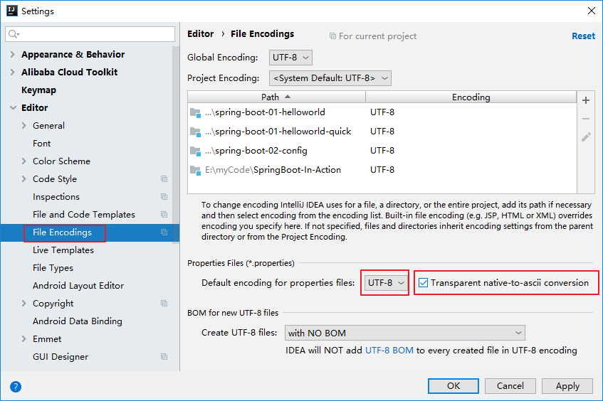

# Spring Boot 从入门到实践


---

# 一、Spring Boot快速入门

本系列教程根据本人实际学习使用 SpringBoot2.x 过程总结整理而来。

## 1、Spring Boot 简介

Spring Boot 用来简化 Spring 应用开发，约定大于配置，删繁就简，just run 就能创建一个独立的、产品级的应用

- 出现背景：

  J2EE（例如 Spring ） 笨重的开发、繁多的配置、低下的开发效率、负责的部署流程和第三方技术集成难度大。

- 解决方案：

  “Spring 全家桶” 时代：

  Spring Boot → J2EE 一站式解决方案

  Spring Cloud → 分布式整体解决方案

- 优点：

  快速创建独立运行的 Spring 项目以及与主流框架集成

  使用嵌入式的 Servlet 容器，应用无需打成 war包

  starters 自动依赖于版本控制

  大量的自动配置，简化开发，也可以修改默认属性值

  开箱即用，无需配置 xml，无代码生成

  生产环境的运行时应用监控

  与云计算天然集成

总结：

> - 简化Spring应用开发的一个框架；
> - 整个Spring技术栈的一个大整合；
> - J2EE开发的一站式解决方案；
>


## 2、微服务

> - 2014由martin fowler提出
> - 微服务：架构风格（服务微化）
> - 一个应用应该是一组小型服务；可以通过HTTP的方式进行互通；
> - 单体应用：ALL IN ONE
> - 微服务：每一个功能元素最终都是一个可独立替换和独立升级的软件单元；
> - [详细参照微服务文档](https://martinfowler.com/articles/microservices.html#MicroservicesAndSoa)
>

### 单体应用：


### 微服务：


## 3、环境准备

### 开发环境：

> - jdk1.8：Spring Boot 推荐jdk1.7及以上；java version "1.8.0_221"
> - maven3.x：maven 3.3以上版本；apache-maven-3.6.1
> - IntelliJIDEA2019：IntelliJ IDEA 2019.1.3 x64
> - SpringBoot 2.2.1.RELEASE：2.2.1；
>

### 开发配置：

#### 1、MAVEN设置：

给 maven 的 `settings.xml` 配置文件的 `profiles` 标签添加下面的配置，设置 maven 的创建项目时的默认编译版本使用 `jdk8`

> ```xml
> <profile>
> <id>jdk-1.8</id>
> <activation>
> <activeByDefault>true</activeByDefault>
> <jdk>1.8</jdk>
> </activation>
> <properties>
> <maven.compiler.source>1.8</maven.compiler.source>
> <maven.compiler.target>1.8</maven.compiler.target>
> <maven.compiler.compilerVersion>1.8</maven.compiler.compilerVersion>
> </properties>
> </profile>
> ```
>

#### 2、IDEA设置：

Idea 整合 Maven：

> 
>
> 

## 4、创建 Spring Boot HelloWorld

### 1、快速开始

首先我们先创建一个统一的 maven 工程，用来管理我们之后学习中所有的项目：

#### 1、新建项目


#### 2、选择Maven项目

#### 3、填写GroupId、ArtifactId

GroupId：`com.demo.springboot`

ArtifactId：`SpringBoot-In-Action`

##### 

#### 5、填写项目名和项目路径

#### 6、创建一个空的maven项目完成，选择允许自动导入

#### 7、删除多余的目录

只保留一个pom.xml文件即可，同时在pom文件中添加springboot依赖和打包类型

```xml
<parent>
    <groupId>org.springframework.boot</groupId>
    <artifactId>spring-boot-starter-parent</artifactId>
    <version>2.2.1.RELEASE</version>
</parent>
<packaging>pom</packaging>
```


### 2、现在开始我们的 Spring Boot HelloWorld 项目：

`一个功能：浏览器发送hello请求，服务器接受请求并处理，响应Hello World字符串`；

#### 1、创建一个maven工程；（jar）

在SpringBoot-In-Action项目中新建一个module,选择maven工程，命名为 spring-boot-01-helloworld


#### 2、导入spring boot相关的依赖

因为springboot的依赖已经在父pom中导入

```xml
<parent>
    <groupId>org.springframework.boot</groupId>
    <artifactId>spring-boot-starter-parent</artifactId>
    <version>2.2.1.RELEASE</version>
</parent>
```

所以在当前的pom中只需要导入spring-boot-starter-web的依赖即可：

```xml
<dependencies>
    <dependency>
        <groupId>org.springframework.boot</groupId>
        <artifactId>spring-boot-starter-web</artifactId>
    </dependency>
</dependencies>
```

完整 `pom` 文件如下：

```xml
<?xml version="1.0" encoding="UTF-8"?>
<project xmlns="http://maven.apache.org/POM/4.0.0"
         xmlns:xsi="http://www.w3.org/2001/XMLSchema-instance"
         xsi:schemaLocation="http://maven.apache.org/POM/4.0.0 http://maven.apache.org/xsd/maven-4.0.0.xsd">
    <parent>
        <artifactId>SpringBoot-In-Action</artifactId>
        <groupId>com.demo.springboot</groupId>
        <version>1.0-SNAPSHOT</version>
    </parent>
    <modelVersion>4.0.0</modelVersion>

    <artifactId>spring-boot-01-helloworld</artifactId>

    <dependencies>
        <dependency>
            <groupId>org.springframework.boot</groupId>
            <artifactId>spring-boot-starter-web</artifactId>
        </dependency>
    </dependencies>

</project>
```

#### 3、编写一个主程序；启动Spring Boot应用


```java
/**
 * @SpringBootApplication 来标注一个主程序类，说明这是一个Spring Boot应用
 */
@SpringBootApplication
public class HelloWorldMainApplication {
    public static void main(String[] args) {
        // Spring应用启动起来
        SpringApplication.run(HelloWorldMainApplication.class, args);
    }
}
```

#### 4、编写相关的Controller、Service

为了演示，我在这里只创建了 `Controller` 类，省略了 Service

```java
@Controller
public class HelloController {

    @ResponseBody
    @RequestMapping("/hello")
    public String hello() {
        return "Hello World!";
    }
}
```

#### 5、运行主程序测试效果

选中 `HelloWorldMainApplication` 右键单击选择 `Run ...` ，或者打开 `HelloWorldMainApplication` 按下快捷键 `Ctrl+Shift+F10` 运行程序，可以看到项目在 `8080` 端口启动：


在浏览器中访问  http://localhost:8080/hello 可以看到正常返回了 `Hello World` 。


至此，我们的第一个 Spring Boot 项目算是创建完了。

#### 6、补充：简化部署

在当前项目，即 `spring-boot-01-helloworld` 的 `pom` 文件中添加下面的配置

```xml
<!-- 这个插件，可以将应用打包成一个可执行的jar包；-->
<build>
    <plugins>
        <plugin>
            <groupId>org.springframework.boot</groupId>
            <artifactId>spring-boot-maven-plugin</artifactId>
        </plugin>
    </plugins>
</build>
```

然后选中当前 `pom` 文件，右键单击，选择 `Run Maven`  → `package` ，将这个应用打成 `jar` 包，可以看到 `target` 文件夹下生成一个名为 `spring-boot-01-helloworld-1.0-SNAPSHOT.jar`  的 `jar` 文件，我们可以直接在命令行使用 `java -jar xxx.jar` 命令进行执行，启动后在浏览器中访问  http://localhost:8080/hello 可以看到正常返回了 `Hello World` 。若要结束程序，关闭命令行窗口即可。


> 思考：为什么我们打包后的程序可以直接在命令行使用 `java jar` 命令就可以部署？

带着疑问我们来分析一下 `spring-boot-01-helloworld-1.0-SNAPSHOT.jar` ，我们使用压缩文件打开 `spring-boot-01-helloworld-1.0-SNAPSHOT.jar`，可以看到如下所示的目录结构：


我们打开 `BOOT-INF` 文件夹看到有 `classes` 和 `lib` 两个文件夹，我们写的代码的二进制字节码就在 `classes` 目录下，而 `lib` 下可以看到是我们项目依赖的所有 `jar` 包，最关键的，我们的项目是一个 `web` 项目，可以看到所依赖的内嵌的 `tomcat` jar包，这是我们项目能独立部署的关键：


其他目录 `META-INF` 存放项目的 `pom` 文件，`org` 目录下存放的是 `springframework` 相关代码。

## 5、Hello World 探究

### 1、POM文件

#### 1、父项目

依赖路径入下图所示：


`spring-boot-01-helloworld` 的 pom：

```xml
<parent>
    <artifactId>SpringBoot-In-Action</artifactId>
    <groupId>com.demo.springboot</groupId>
    <version>1.0-SNAPSHOT</version>
</parent>
```

它的父项目是 `SpringBoot-In-Action` 中的 pom：

```xml
<parent>
    <groupId>org.springframework.boot</groupId>
    <artifactId>spring-boot-starter-parent</artifactId>
    <version>2.2.1.RELEASE</version>
</parent>

<packaging>pom</packaging>

<groupId>com.demo.springboot</groupId>
<artifactId>SpringBoot-In-Action</artifactId>
<version>1.0-SNAPSHOT</version>

<modules>
    <module>spring-boot-01-helloworld</module>
</modules>
```

而

```xml
<parent>
    <groupId>org.springframework.boot</groupId>
    <artifactId>spring-boot-starter-parent</artifactId>
    <version>2.2.1.RELEASE</version>
</parent>
```

的父 pom 是 `spring-boot-starter-parent-2.2.1.RELEASE.pom`:

```xml
<parent>
    <groupId>org.springframework.boot</groupId>
    <artifactId>spring-boot-dependencies</artifactId>
    <version>2.2.1.RELEASE</version>
    <relativePath>../../spring-boot-dependencies</relativePath>
</parent>
<artifactId>spring-boot-starter-parent</artifactId>
```

而它的父 pom 是 `spring-boot-dependencies-2.2.1.RELEASE.pom`:

```xml
<groupId>org.springframework.boot</groupId>
<artifactId>spring-boot-dependencies</artifactId>
<version>2.2.1.RELEASE</version>
<packaging>pom</packaging>

在这个pom里边可以看到，它是用来真正管理Spring Boot应用里面的所有依赖版本，定义了每一个依赖的版本；
```


`spring-boot-dependencies-2.x.RELEASE.pom` 可以成称为 `Spring Boot的版本仲裁中心`；

以后我们导入其他依赖默认是不需要写版本；（当然没有在dependencies里面管理的依赖自然需要声明版本号）

#### 2、导入的其他依赖

```xml
<dependency>
    <groupId>org.springframework.boot</groupId>
    <artifactId>spring-boot-starter-web</artifactId>
</dependency>
```

**spring-boot-starter**-`web` ：我们可以将其拆分为 `spring-boot-starter` 和 `web` 两部分

- spring-boot-starter：spring-boot 场景启动器；spring-boot-starter-web 帮我们导入了 web 模块正常运行所依赖的组件。

我们按下 `Ctrl` 点击 spring-boot-starter-web 进入 `spring-boot-starter-web-2.2.1.RELEASE.pom`，可以看到它导入了很多 web 模块正常运行需要的相关依赖：


Spring Boot 为我们提供了简化企业级开发的绝大多数场景的 starter pom（启动器），只要引入了相应场景的  starter pom ，相关技术的绝大部分配置将会消除（即自动配置），从而简化我们的开发。很多业务场景中我们就会使用到 Spring Boot 为我们自动配置的 bean，同时 Spring Boot 对这些场景依赖的 jar 也做了严格的测试与版本控制，我们可以不必担心 jar 版本的适配问题。

在 Spring Boot 中还有很多这样的启动器，我们打开[官方文档](https://docs.spring.io/spring-boot/docs/2.2.1.RELEASE/reference/htmlsingle/#using-boot-starter)可以看到关于启动器的描述：


Spring Boot 将所有的功能场景都抽取出来，做成一个个的 starters（启动器），只需要在项目里面引入这些starter 相关场景的所有依赖都会导入进来。要用什么功能就导入什么场景的启动器。而我们一般的开发也是围绕着这些 starter 来展开。

### 2、主程序类（主入口类）

```java
/**
 *  @SpringBootApplication 来标注一个主程序类，说明这是一个Spring Boot应用，没有这个注解项目无法启动
 */
@SpringBootApplication
public class HelloWorldMainApplication {

    public static void main(String[] args) {

        // Spring应用启动起来
        SpringApplication.run(HelloWorldMainApplication.class, args);
    }
}
```

#### 1、@SpringBootApplication

@**SpringBootApplication**:    `Spring Boot应用`标注在某个类上说明这个类是SpringBoot的主配置类，SpringBoot 就运行这个类的 `main` 方法来启动 SpringBoot 应用；

进入 `@SpringBootApplication` 注解内部，可以看到它实际上是一个复合注解：

```java
@Target({ElementType.TYPE})
@Retention(RetentionPolicy.RUNTIME)
@Documented
@Inherited
@SpringBootConfiguration
@EnableAutoConfiguration
@ComponentScan(
    excludeFilters = {@Filter(
    type = FilterType.CUSTOM,
    classes = {TypeExcludeFilter.class}
), @Filter(
    type = FilterType.CUSTOM,
    classes = {AutoConfigurationExcludeFilter.class}
)}
)
public @interface SpringBootApplication {
```

#### 2、@SpringBootConfiguration

@**SpringBootConfiguration**：Spring Boot 的配置类；

`作用`：标注在某个类上，表示这是一个Spring Boot 的配置类；

进入 `@SpringBootConfiguration` 内部可以看到，它被 Spring 的 `@Configuration` 注解所注解：

```java
@Configuration
public @interface SpringBootConfiguration {
```

@**Configuration**：配置类上来标注这个注解；配置类 ===  配置文件；

进入 `@Configuration` 内部可以看到，它被 Spring 的 `@Component` 注解所注解；配置类其实也是容器中的一个组件。

```java
@Component
public @interface Configuration {
```

#### 3、@EnableAutoConfiguration

@**EnableAutoConfiguration**：开启自动配置功能

以前在 Spring 中我们需要配置的东西，现在 Spring Boot 帮我们自动配置；@**EnableAutoConfiguration**告诉SpringBoot 开启自动配置功能，这样自动配置才能生效； 

进入 `@EnableAutoConfiguration` 内部可以看到下面的代码：

```java
@AutoConfigurationPackage
@Import({AutoConfigurationImportSelector.class})
public @interface EnableAutoConfiguration {
```

@**AutoConfigurationPackage**：自动配置包，将主配置类（`@SpringBootApplication` 标注的类）的所在包及下面所有子包里面的所有组件扫描到 Spring 容器

进入 `@Configuration` 内部可以看到它被 `@Import` 注解所注解。Spring 的底层注解 @Import，给容器中导入一个组件；导入的组件由 Registrar.class 指定；

```java
@Import({Registrar.class})
public @interface AutoConfigurationPackage {
```

进入 Registrar  静态内部类可以看到如下代码：

```java
static class Registrar implements ImportBeanDefinitionRegistrar, DeterminableImports {
    Registrar() {
    }
	// 注册一些 Bean 定义信息，进行组件的导入工作；metadata：注解的元信息
    public void registerBeanDefinitions(AnnotationMetadata metadata, BeanDefinitionRegistry registry) {
        AutoConfigurationPackages.register(registry, (new AutoConfigurationPackages.PackageImport(metadata)).getPackageName());
    }

    public Set<Object> determineImports(AnnotationMetadata metadata) {
        return Collections.singleton(new AutoConfigurationPackages.PackageImport(metadata));
    }
}
```

我们在代码中打上断点来看一下：


@**Import({AutoConfigurationImportSelector.class})**：给容器中导入组件xxx

**AutoConfigurationImportSelector**：导入哪些组件的选择器；

我们进入 `AutoConfigurationImportSelector` 中可以看到如下代码： 

```java
// 将所有需要导入的组件以全类名的方式返回；这些组件就会被添加到容器中
protected AutoConfigurationImportSelector.AutoConfigurationEntry getAutoConfigurationEntry(AutoConfigurationMetadata autoConfigurationMetadata, AnnotationMetadata annotationMetadata) {
    if (!this.isEnabled(annotationMetadata)) {
        return EMPTY_ENTRY;
    } else {
        AnnotationAttributes attributes = this.getAttributes(annotationMetadata);
        List<String> configurations = this.getCandidateConfigurations(annotationMetadata, attributes);
        configurations = this.removeDuplicates(configurations);
        Set<String> exclusions = this.getExclusions(annotationMetadata, attributes);
        this.checkExcludedClasses(configurations, exclusions);
        configurations.removeAll(exclusions);
        configurations = this.filter(configurations, autoConfigurationMetadata);
        this.fireAutoConfigurationImportEvents(configurations, exclusions);
        return new AutoConfigurationImportSelector.AutoConfigurationEntry(configurations, exclusions);
    }
}
```

将所有需要导入的组件以全类名的方式返回；这些组件就会被添加到容器中。即`AutoConfigurationImportSelector`会给容器中导入非常多的自动配置类（xxxAutoConfiguration）；就是给容器中导入这个场景需要的所有组件，并配置好这些组件。

我们在代码中打断点可以看到如下的结果：


有了自动配置类，就免去了我们手动编写配置注入功能组件等的工作。

进入上面代码中的 `getCandidateConfigurations` 方法，可以看到如下代码：

```java
// 获取候选配置
protected List<String> getCandidateConfigurations(AnnotationMetadata metadata, AnnotationAttributes attributes) {
    List<String> configurations = SpringFactoriesLoader.loadFactoryNames(this.getSpringFactoriesLoaderFactoryClass(), this.getBeanClassLoader());
    Assert.notEmpty(configurations, "No auto configuration classes found in META-INF/spring.factories. If you are using a custom packaging, make sure that file is correct.");
    return configurations;
}
```

上面代码中调用了 `SpringFactoriesLoader.loadFactoryNames(EnableAutoConfiguration.class, ClassLoader)`方法，我们在这个进入这个方法可以看下面的代码：

```java
public static List<String> loadFactoryNames(Class<?> factoryType, @Nullable ClassLoader classLoader) {
    // 获取工厂名
    String factoryTypeName = factoryType.getName();
    return (List)loadSpringFactories(classLoader).getOrDefault(factoryTypeName, Collections.emptyList());
}

private static Map<String, List<String>> loadSpringFactories(@Nullable ClassLoader classLoader) {
    MultiValueMap<String, String> result = (MultiValueMap)cache.get(classLoader);
    if (result != null) {
        return result;
    } else {
        try {
            // 用类加载器从类路径 "META-INF/spring.factories" 中获取资源
            Enumeration<URL> urls = classLoader != null ? classLoader.getResources("META-INF/spring.factories") : ClassLoader.getSystemResources("META-INF/spring.factories");
            LinkedMultiValueMap result = new LinkedMultiValueMap();

            while(urls.hasMoreElements()) {
                URL url = (URL)urls.nextElement();
                UrlResource resource = new UrlResource(url);
                // 从获取的资源中拿出 properties 配置文件，把获取的资源当作 properties 配置文件
                Properties properties = PropertiesLoaderUtils.loadProperties(resource);
                Iterator var6 = properties.entrySet().iterator();

                while(var6.hasNext()) {
                    Entry<?, ?> entry = (Entry)var6.next();
                    // 从 properties 文件中拿到 factoryTypeName
                    String factoryTypeName = ((String)entry.getKey()).trim();
                    String[] var9 = StringUtils.commaDelimitedListToStringArray((String)entry.getValue());
                    int var10 = var9.length;

                    for(int var11 = 0; var11 < var10; ++var11) {
                        String factoryImplementationName = var9[var11];
                        result.add(factoryTypeName, factoryImplementationName.trim());
                    }
                }
            }

            cache.put(classLoader, result);
            return result;
        } catch (IOException var13) {
            throw new IllegalArgumentException("Unable to load factories from location [META-INF/spring.factories]", var13);
        }
    }
}
```

所以根据上面的分析我的得知：`Spring Boot 在启动的时候从类路径下的 META-INF/spring.factories 中获取 EnableAutoConfiguration 指定的值，将这些值作为自动配置类导入到容器中，自动配置类就生效，帮我们进行自动配置工作`。以前我们在 Spring 中需要自己配置的东西，在 Spring Boot 中自动配置类都帮我们配了。


综上，J2EE 的整体整合解决方案和自动配置都在 spring-boot-autoconfigure-2.2.1.RELEASE.jar (spring-boot-autoconfigure-x.x.x.RELEASE.jar )中：


## 6、使用 Spring Initializer 快速创建 Spring Boot项目

### 1、IDEA：使用 Spring Initializer快速创建项目

所有的 IDE 都支持使用 Spring 的项目创建向导快速创建一个 Spring Boot 项目，下面我们来看一下如何在 idea 中快速创建一个 Spring Boot 项目。

1、选择`File` → `New` → `Project` 或是在一个已经存在的工程中选中工程名然后 `New` → `Module`：


2、填写基本信息 `GroupID`、`ArtifactID`


3、选择我们需要依赖的模块


4、点击 `Finish`，接下来向导会联网创建 Spring Boot 项目


查看默认生成的 Spring Boot 项目，我们可以看到：

- 主程序已经生成好了，我们只需要写我们自己的逻辑
- `resources` 文件夹中目录结构：
  - `static`：保存所有的静态资源： js、css、 images等；
  - `templates`：保存所有的模板页面（Spring Boot 默认 jar 包使用嵌入式的 Tomcat，默认不支持 JSP 页面），可以使用模板引擎（`freemarker`、`thymeleaf`等）；
  - `application.properties`：Spring Boot 应用的配置文件；可以修改一些默认设置，比如端口等

我们在 `com.demo.spring.controller` 包下新见一个 `HelloController` 来测试一下我们新建的项目


HelloController 代码如下：

```java
//这个类的所有方法返回的数据直接写给浏览器，（如果是对象转为json数据）
//@ResponseBody
//@Controller
//  上面两行一般多用在 Spring 项目中
@RestController // 在 Spring Boot 和 Spring4.2.x 之后使用这个来简化开发，返回 RESTAPI 规范的接口
public class HelloController {
    @RequestMapping("/hello")
    public String hello(){
        return "hello world quick!";
    }
}
```

在浏览器中访问 http://localhost:8080/hello 可以得到下面的返回效果：


### 2、通过浏览器访问https://start.spring.io/快速创建项目


执行完上面的操作后，浏览器会自动下载一个创建好的项目，我们使用idea打开即可。

以上，就是我们 Spring Boot 快速入门的全部内容，更多详细内容请查看源代码了解。

## 源代码：

[SpringBoot-In-Action](https://github.com/Runewbie/SpringBoot-In-Action)

- [spring-boot-01-helloworld](https://github.com/Runewbie/SpringBoot-In-Action/tree/master/spring-boot-01-helloworld)

- [spring-boot-01-helloworld-quick](https://github.com/Runewbie/SpringBoot-In-Action/tree/master/spring-boot-01-helloworld-quick)

# 二、Spring Boot配置

这一章节的主要内容是 Spring Boot 的配置，包括配置文件、加载顺序和配置原理。

## 1、配置文件

### `类型`：

Spring Boot 使用一个全局的配置文件，配置文件名是固定的，Spring Boot 中存在两种类型的配置文件：

- `application.properties`

- `application.yml` 

### `作用`：

修改 Spring Boot 自动配置的默认值；Spring Boot在底层都给我们自动配置好。

### `位置`：

配置文件放在 `src/main/resources` 目录或者 `类路径/config` 下。

YAML（YAML Ain't Markup Language）：递归写法

​	YAML  A Markup Language：是一个标记语言

​	YAML   isn't Markup Language：不是一个标记语言；

标记语言：

​	以前的配置文件；大多都使用的是  **xxx.xml**文件；

​	YAML：**以数据为中心**，比json、xml等更适合做配置文件；

​	YAML：配置例子

了解更多 yml 内容，可以参考[官方文档语法规范](https://yaml.org/)

新建一个 `spring-boot-02-config` 的 `Spring Boot`项目，同时选上 web 和 lombok 依赖。


可以看到我们新建的项目默认使用的是 `application.properties` 作为配置文件。

我们可以在 `resources` 目录下再新建一个 `application.yml` 文件。

我们在 yml 文件中配置一下项目启动的端口号：

```yml
server:
  port: 8088
```

启动后我们可以看到我的项目是在 `8088` 端口启动的：


如果是以前基于 Spring 的 Web 项目，则需要在 web.xml 文件中做如下配置：

```xml
<server>
	<port>8081</port>
</server>
```

可以看到使用 yml 语法比之前的 xml 文件简洁很多。

## 2、YAML语法

### 1、基本语法

- 使用缩进表示层级关系
- 缩进时不允许使用`Tab`键，只允许使用`空格`
- 缩进的空格数据不限，只要相同层级的元素左侧对齐即可
- 属性大小写敏感

简要概括就是：k:(空格)v：表示一对键值对（空格必须有）；以**空格**的缩进来控制层级关系；只要是左对齐的一列数据，都是同一个层级的；属性和值也是`大小写敏感`；

```yaml
server:
    port: 8088
    path: /hello
```

### 2、值的写法

- 对象：键值对的集合
- 数组：一组按次序排列的值
- 字面量：单个的、不可再分的值

#### 字面量：普通的值（数字，字符串，布尔）

`k: v`：字面直接来写；`（注意键值对之间有空格）`

字符串默认不用加上单引号或者双引号；

`""`：双引号；不会转义字符串里面的特殊字符；特殊字符会作为本身想表示的意思

>  name:   "zhangsan \n lisi"：输出；zhangsan 换行  lisi

`''`：单引号；会转义特殊字符，特殊字符最终只是一个普通的字符串数据

> name:   ‘zhangsan \n lisi’：输出；zhangsan \n  lisi

#### 对象、Map（属性和值）（键值对）：

`k: v`：在下一行来写对象的属性和值的关系；注意缩进

对象还是`k: v`的方式

```yaml
friends:
		lastName: zhangsan
		age: 20
```

行内写法：对象的`k: v`写法还可以转换成行内写法

```yaml
friends: {lastName: zhangsan,age: 18}
```

#### 数组（List、Set）：

用`- 值`（短横线、空格 、值）表示数组中的一个元素

```yaml
pets:
 - cat
 - dog
 - pig
```

行内写法：数组也可以使用行内写法

```yaml
pets: [cat,dog,pig]
```

## 3、配置文件值注入

前面第2节讲完 yml 的语法，下面我们来实战一下。在 `src\main\java\com\demo\springboot\bean` 包下新建如下类：

```java
/**
 * 将配置文件中配置的每一个属性的值，映射到这个组件中
 * @ConfigurationProperties：告诉SpringBoot将本类中的所有属性和配置文件中相关的配置进行绑定；
 *      prefix = "person"：配置文件中哪个下面的所有属性进行一一映射
 *
 * 只有这个组件是容器中的组件，才能容器提供的@ConfigurationProperties功能；
 *
 */
@Data // 使用lombok注解
@ToString // 使用lombok注解
@Component // 只有这个组件是容器中的组件，才能容器提供的@ConfigurationProperties功能
@ConfigurationProperties(prefix = "person")
public class Person {
    private String lastName;
    private Integer age;
    private Boolean boss;
    private Date birth;
    private Map<String,Object> maps;
    private List<Object> lists;
    private Dog dog;
}
```

```java
@Data
@ToString
public class Dog {
    private String name;
    private Integer age;
}
```

然后在`application.yml`配置文件中添加下面内容：

```yml
# 配置 Person 和 Dog 的值
person:
  lastName: lisi # lastName === last-name 两个效果是一样的
  age: 20
  boss: false
  birth: 1988/01/02
  maps: {k1: v1,k2: 12}
  lists:
    - zhangsan
    - lisi
  dog:
    name: 阿黄
    age: 2
```

`注意：`我们写好配置文件后，还需要将配置文件和对应的类进行映射，我们使用 `@ConfigurationProperties(prefix = "person")` 注解来将配置文件和当前组件进行映射；因为使用`@ConfigurationProperties`的前提是这个类必须是容器中的组件，所以我们还需要使用`@Component`来注解我们的类。

做完上面的步骤后我们会发现在idea中出现了如下提示：


提示我们没有在类路径下找到SpringBoot配置注解处理器，之前我们在yml文件中进行配置的时候也发现了我们自己定义的类，并没有自动提示。关于这一点，Spring Boot 也替我们考虑到了，我们点击上边的提示，可以打开Spring Boot的[文档](https://docs.spring.io/spring-boot/docs/2.1.6.RELEASE/reference/html/configuration-metadata.html#configuration-metadata-annotation-processor)：

> ## B.3 Generating Your Own Metadata by Using the Annotation Processor
>
> You can easily generate your own configuration metadata file from items annotated with `@ConfigurationProperties` by using the `spring-boot-configuration-processor` jar. The jar includes a Java annotation processor which is invoked as your project is compiled. To use the processor, include a dependency on `spring-boot-configuration-processor`.
>
> With Maven the dependency should be declared as optional, as shown in the following example:
>
> ```xml
> <dependency>
> 	<groupId>org.springframework.boot</groupId>
> 	<artifactId>spring-boot-configuration-processor</artifactId>
> 	<optional>true</optional>
> </dependency>
> ```

文档中提示我们需要在`pom`中引入下面的依赖：

```xml
<!--导入配置文件处理器，配置文件进行绑定就会有提示-->
<dependency>
    <groupId>org.springframework.boot</groupId>
    <artifactId>spring-boot-configuration-processor</artifactId>
    <optional>true</optional>
</dependency>
```

引入依赖后可以看到我们的 `Person` 类中出现了重新运行程序的提示：


我们重启项目后，再次在`application.yml`文件中配置时就可以看到出现了自动提示信息：


完成上面的操作后我们来测试一下，在测试类中输出一下`Person`类的值，测试类`SpringBoot02ConfigApplicationTests`中加入如下代码：

```java
@Autowired
private Person person;
@Test
void contextLoads() {
    System.out.println(person);
}
```

执行测试用例方法，可以看到下面的结果：


同样的，我们除了在 `application.yml` 中配置类的属性值外，也可以在 `application.properties` 文件中配置，我们注释掉 `application.yml` 中的内容，然后在 `application.properties` 配置如下内容：

```properties
server.port=8888

# 配置 Person 和 Dog 的值
person.last-name=李四
person.age=18
person.boss=false
person.birth=1988/01/02
person.maps.k1=1
person.maps..k2=2
person.lists=a,b,c
person.dog.name=阿黄
person.dog.age=2
```

同样的执行我们的测试方法，可以看到测试通过：


值得注意的是，使用 `application.properties` 配置后我们看到输出的`lastname`和`name`是乱码！这个就是我们下面要讲的内容

### 1、properties配置文件在idea中默认utf-8可能会乱码

因为我们的`idea`默认使用的是`utf-8`编码，但是`application.properties` 使用的是`ASCII` 码，所以我们需要在idea中设置一下：



配置好后重新执行测试用例可以看到输出结果正常。


### 2、@Value获取值和@ConfigurationProperties获取值比较

我们除了使用`@ConfigurationProperties`注解来获取值以外，还可以使用`@Value`来获取配置文件中的值

`@Value`的作用和我们在xml文件中使用<bean>标签配置的作用一样：

```xml
<bean class="Person">
	<property name="lastName" value="字面量/${key}从环境变量、配置文件中获取值/#{SpEL}"></property>
<bean/>
```

所以我们的`@Value`注解中也可以使用`字面量/${key}从环境变量、配置文件中获取值/#{SpEL}`来进行值的获取。

我们修改`Person`类,注意注释掉`@ConfigurationProperties(prefix = "person")`：

```java
//@ConfigurationProperties(prefix = "person")
public class Person {

    /**
     * <bean class="Person">
     *      <property name="lastName" value="字面量/${key}从环境变量、配置文件中获取值/#{SpEL}"></property>
     * <bean/>
     */
    @Value("${person.last-name}")
    private String lastName;
    @Value("#{11*2}")
    private Integer age;
    @Value("true")
    private Boolean boss;
```

测试运行后可以看到如下效果，可以看到我们配置的属性都获取到了值：


那么`@Value`获取值和`@ConfigurationProperties`获取值有什么不同呢？我们来比较一下：

|                      | @ConfigurationProperties | @Value     |
| -------------------- | ------------------------ | ---------- |
| 功能                 | 批量注入配置文件中的属性 | 一个个指定 |
| 松散绑定（松散语法） | 支持                     | 不支持     |
| SpEL                 | 不支持                   | 支持       |
| JSR303数据校验       | 支持                     | 不支持     |
| 复杂类型封装         | 支持                     | 不支持     |

属性名匹配规则：（Relaxed binding 松散绑定）

- person.lastName：标准写法方式

- person.last-name：大写用`-`（中划线）
- person.last_name：大写用`_`（下划线）
- PERSON_LAST_NAME：推荐系统属性使用这个写法

JSR303数据校验：

要使用JSR303数据校验可以在在代码中引入`@Validated`和其相关注解。修改`Person`类：

```java
@ConfigurationProperties(prefix = "person")
@Validated
public class Person {
    @Email //lastName必须是邮箱格式
    private String lastName;
```

执行测试用例会出现报错，因为我们的用户名要求为邮箱格式：

`注意`：要使用`JSR303`数据校验，在注入值的时候必须是使用`@ConfigurationProperties`注解来进行注入，使用`@Value`无效。

`总结：`

- 无论配置文件`yml`还是`properties`它们都能获取到值；

- 如果我们只是在某个业务逻辑中需要获取一下配置文件中的某项值，使用`@Value`；

- 如果我们专门编写了一个javaBean来和配置文件进行映射，我们就直接使用`@ConfigurationProperties`,

### 3、配置文件注入值数据校验

```java
@Data
@ToString
@Component // 只有这个组件是容器中的组件，才能容器提供的@ConfigurationProperties功能
@ConfigurationProperties(prefix = "person")
@Validated
public class Person {
    /**
     * <bean class="Person">
     *      <property name="lastName" value="字面量/${key}从环境变量、配置文件中获取值/#{SpEL}"></property>
     * <bean/>
     */
//    @Value("${person.last-name}")
    @Email //lastName必须是邮箱格式
    private String lastName;
//    @Value("#{11*2}")
    private Integer age;
//    @Value("true")
    private Boolean boss;
    private Date birth;
    private Map<String,Object> maps;
    private List<Object> lists;
    private Dog dog;
}
```

### 4、@PropertySource&@ImportResource&@Bean

`@ConfigurationProperties`：

- 与`@Bean`结合为属性赋值
- 与`@PropertySource`（只适用于`properties`文件）结合读取指定文件


# 三、Spring Boot与日志

# 四、Spring Boot与Web开发
# 五、Spring Boot与Docker

# 六、Spring Boot自定义配置原理
# 七、Spring Boot启动配置原理
# 八、Spring Boot自定义Staters
# 九、Spring Boot与缓存
# 十、Spring Boot与消息
# 十一、Spring Boot与检索
# 十二、Spring Boot与任务
# 十三、Spring Boot与安全
# 十四、Spring Boot 与分布式
# 十五、Spring Boot 与开发热部署
# 十六、Spring Boot与监控管理


